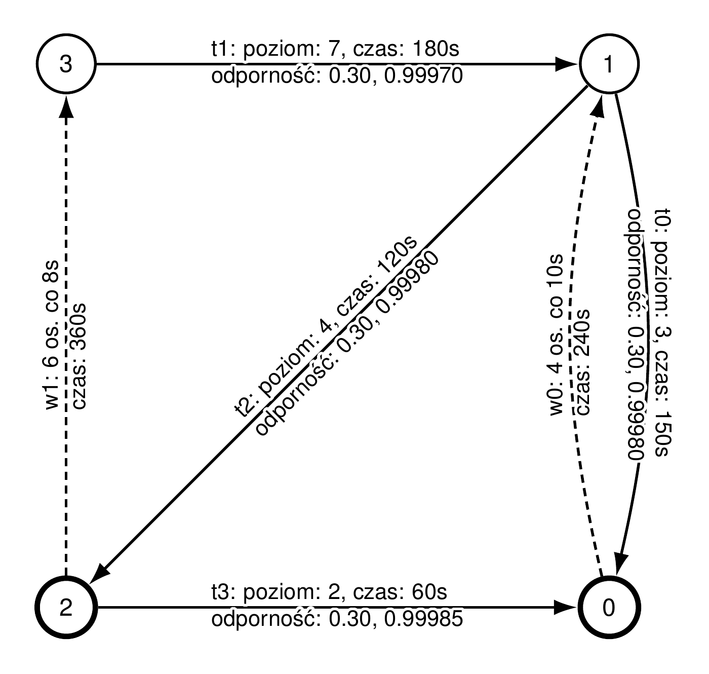

# Large assignment 2: Ski resort extensions

An extended ski-resort simulation with multiple athlete decision strategies, shortest-path planning, route boredom, athlete history, queue statistics, and generated resort maps.

[All homework](../README.md) · [Part 1](../duze-zadanie-1/) · [Original task PDF](po2526-osrodek-narciarski-2.pdf)

## Example output

A map generated by the simulator: solid arrows represent ski routes, dashed arrows represent lifts, and numbered circles are junctions. Bold circles mark junctions connected to external transport. The labels show route difficulty, travel times, and lift capacity.

<p align="center">
  <a href="docs/resort-map.png">
    
  </a>
</p>

The [preview input](docs/preview-input.txt) uses the first course sample with a compact arrangement of the map coordinates; the simulation parameters are unchanged. Click the image to view it at full resolution.

## Build and run

Requires JDK 21 or newer. Run these commands from this directory:

```sh
javac --release 21 -encoding UTF-8 -d out $(find src/main/java -name "*.java")
java -ea -cp out skiresort.app.Main output/sample-1 123 < przykladowe-dane-1.txt
java -ea -cp out skiresort.app.Main output/sample-2 123 < przykladowe-dane-2.txt
```

The first argument is the directory for generated TeX maps. The optional second argument is the random seed; omit it for a new seed on each run. Input comes from standard input, while events and final statistics are printed to standard output.

## Tests

The existing automated and JUnit suites cover event ordering, lift dispatch and queues, shortest paths, and input parsing. Required JUnit 4.12 and Hamcrest 1.3 libraries are included under `lib/`.

```sh
javac --release 21 -encoding UTF-8 \
  -cp "lib/junit-4.12.jar:lib/hamcrest-core-1.3.jar" \
  -d out-test $(find src/main/java src/test/java -name "*.java")

java -ea -cp "out-test:lib/junit-4.12.jar:lib/hamcrest-core-1.3.jar" \
  skiresort.tests.AutomatedTests

java -ea -cp "out-test:lib/junit-4.12.jar:lib/hamcrest-core-1.3.jar" \
  org.junit.runner.JUnitCore skiresort.tests.LiftAndBfsJUnitTests
```

The classpath examples use the macOS/Linux separator `:`. On Windows, use `;` between classpath entries.

## Maps

Each run writes these files inside the selected output directory:

- `parametry.tex`: resort parameters.
- `statystyki.tex`: usage statistics.
- `historia-sportowiec-<id>.tex`: a map for each tracked athlete.

To render a generated map as PDF, use a LaTeX installation with the packages requested by the generated file, including TikZ:

```sh
cd output/sample-1
pdflatex parametry.tex
```

Java compilation and simulation do not require LaTeX. The course-provided map generator is retained under `src/main/java/kadra/mapki/`; the simulation implementation is under `src/main/java/skiresort/`.

To reproduce the preview above after compiling the program:

```sh
java -ea -cp out skiresort.app.Main output/preview 123 < docs/preview-input.txt
cd output/preview
pdflatex parametry.tex
```

The README image is a PNG rendering of this PDF with the empty page margins cropped.

## Task description

The original Polish assignment is preserved as the authored [Ośrodek Narciarski – część 2 PDF](po2526-osrodek-narciarski-2.pdf). It extends [part 1](../duze-zadanie-1/), whose original statement is also included.
